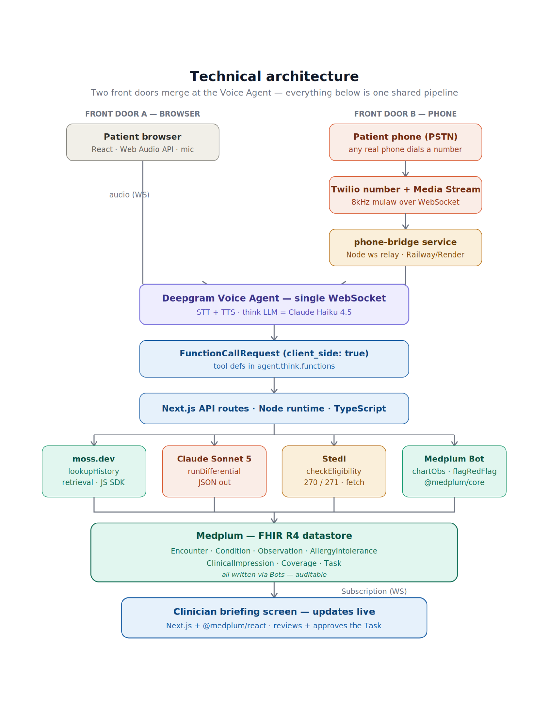

# Agentic Intake — Baymax

A patient checks in by voice (browser or phone). While they talk, a voice agent identifies them,
charts their symptoms as real FHIR resources, runs a cited differential, verifies insurance
eligibility, and flags anything urgent — so by the time they'd sit down, the clinician's screen is
already populated. Built for the YC × Medplum Agentic Healthcare Hackathon.

## Live deployments

| Component | URL |
|---|---|
| App (frontend + API routes) | https://baymax-jet.vercel.app |
| Patient intake (voice, browser) | https://baymax-jet.vercel.app/intake |
| Clinician dashboard | https://baymax-jet.vercel.app/clinician |
| Phone bridge (Twilio ↔ Deepgram relay) | https://baymax-phone-bridge.onrender.com |
| Twilio number | +1 (805) 590-5092 |

## What it does

1. Patient opens `/intake` or calls the Twilio number. The agent asks for their name, looks them
   up (or registers them on the spot if they're new), and starts the visit.
2. As they describe symptoms, the agent charts each one as a FHIR `Observation`/`Condition`/
   `AllergyIntolerance`, pulls relevant history via semantic search (moss.dev), runs a ranked
   differential (LLM), and checks insurance eligibility (Stedi).
3. If it hears a red-flag finding, it drafts a `Task` for the clinician to approve.
4. `/clinician` shows a live per-patient dashboard: problem list, a likelihood-ranked differential
   chart, suggested next steps, pending Tasks with an Approve action, and verified cost.
5. When the intake ends, the on-call doctor automatically gets a phone call summarizing the case.
   The clinician can also trigger a "Call Doctor" button manually — that call speaks the full chart
   and captures the doctor's spoken reply back onto the dashboard.

## Stack

| Layer | Tech |
|---|---|
| Web app | Next.js 15 (App Router), React 19, TypeScript, Vercel |
| Voice agent | Deepgram Voice Agent API (STT + LLM + TTS over one WebSocket) |
| Phone path | Twilio number → Media Streams → standalone Node `ws` service on Render |
| Retrieval | moss.dev (semantic search over patient history) |
| Differential LLM | OpenAI-compatible gateway (see `lib/llm-gateway.ts`) |
| Eligibility | Stedi 270/271 eligibility API (test mode) |
| Outbound calls | Twilio REST API (`lib/twilio.ts`) |
| FHIR data | Medplum (hosted, FHIR R4) |
| Clinician UI | Next.js + `@medplum/react` |


## Architecture

Two front doors (browser mic or phone via Twilio) merge at the Deepgram Voice Agent. Tool calls fan out to moss.dev, the differential LLM, Stedi eligibility, and Medplum Bots; results land in the FHIR datastore and stream to the clinician briefing screen.



## Repo layout

```
app/
  intake/            patient voice intake (browser)
  clinician/          clinician dashboard (queue + per-patient chart)
  api/
    agent-config/      Deepgram agent Settings (prompt + tool defs)
    intake/            start/end an Encounter
    patients/          name-based patient lookup
    tasks/approve/      approve a red-flag Task
    tools/              the 6 voice-agent tools (identifyPatient, chartObservation,
                         lookupHistory, runDifferential, checkEligibility, flagRedFlag)
    notify-doctor/      manual "Call Doctor" trigger
    twilio/             Twilio webhook (captures the doctor's spoken response)
    admin/import/       bulk patient import (see docs/import-payload-example.json)
lib/                    Medplum/Deepgram/moss/Stedi/Twilio/LLM clients + FHIR write helpers
seed/                   one-time seed script + moss indexing
phone-bridge/           standalone Node service: Twilio Media Streams <-> Deepgram (deploy separately)
docs/                   import payload spec/example
```

## Local development

```bash
npm install
cp .env.local.example .env.local   # fill in real keys
npm run dev                        # http://localhost:3000
```

`phone-bridge/` is a separate deployable with its own `package.json`:

```bash
cd phone-bridge
npm install
cp .env.example .env               # fill in real keys
npm run dev
```

## Environment variables

See `.env.local.example` and `phone-bridge/.env.example` for the full list. Notably:

- `AI_GATEWAY_KEY` — differential-generation LLM (independent of Deepgram's own think-model key)
- `MOSS_API_KEY` / `MOSS_PROJECT_ID` — semantic history retrieval
- `STEDI_API_KEY` — eligibility checks (currently falls back to a labeled stub in test mode; see
  `lib/stedi.ts` for why)
- `TWILIO_ACCOUNT_SID` / `TWILIO_AUTH_TOKEN` / `TWILIO_PHONE_NUMBER` — outbound calls
- `DOCTOR_PHONE_NUMBER` — who gets called when an intake finishes or "Call Doctor" is clicked

## Known limitations

- **Stedi eligibility** returns a labeled stub (`[STUBBED -- ...]`) unless the configured provider
  NPI is actually enrolled with the target payer — Stedi's test mode has no generic mock payer.
- **Medplum WebSocket subscriptions** aren't enabled on the hosted project (requires a support
  request to Medplum), so the clinician dashboard polls every 3s instead of updating via push.
- **Render free tier** spins the phone-bridge down after inactivity; the first call after idle time
  may be slow to connect while it cold-starts.
