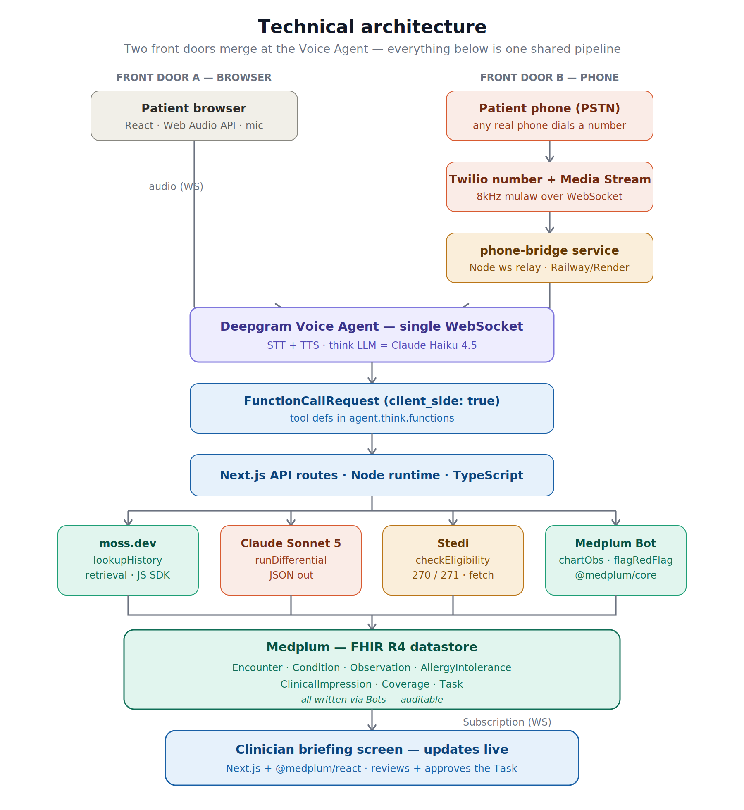

<div align="center">

# Baymax

**Pre-visit briefing**<br />
A voice agent that charts intake straight to FHIR, thinks through a differential, and gets the doctor on the phone.<br />
An agentic healthcare build powered by Deepgram, Medplum, moss.dev, and Stedi.

[](https://github.com/techadnank9/baymax/stargazers)
[](LICENSE.txt)


[Quickstart](#quickstart) · [Try the voice intake](https://baymax-jet.vercel.app/intake) · [Clinician dashboard](https://baymax-jet.vercel.app/clinician) · [Architecture](#architecture) · [Robot half of this project](https://github.com/KaushikSiva/baymax)

</div>

> [!IMPORTANT]
> Baymax is a hackathon prototype, not a medical device. It charts and drafts for clinician
> review, it does not diagnose, prescribe, or replace clinical judgment. Every differential and
> escalation exists to be approved by a human, never acted on unreviewed.

---

## Contents

- [The problem](#the-problem)
- [What it does](#what-it-does)
- [Architecture](#architecture)
- [Sponsors](#sponsors)
- [Stack](#stack)
- [Live deployments](#live-deployments)
- [Quickstart](#quickstart)
- [Environment variables](#environment-variables)
- [API reference](#api-reference)
- [Repo layout](#repo-layout)
- [Known limitations](#known-limitations)
- [License](#license)

## The problem

By the time a patient reaches the exam room, none of what happened before them has reached the clinician yet. A patient checks in and describes their symptoms to a receptionist or a form, and that information sits unread until the doctor walks in and re-asks the same questions from scratch, burning the first minutes of the visit on things the patient already said. In a hospital the gap is worse: nurses walk rounds manually, and a patient's spoken symptom or a monitor spiking heart rate or dropping oxygen can sit unnoticed until someone happens to check that room, because there's no system connecting what a patient says or a monitor reads to the person who needs to act on it in real time.

This repo closes that gap on the digital side. A companion project, [KaushikSiva/baymax](https://github.com/KaushikSiva/baymax), closes it on the physical side: a Unitree G1 humanoid that patrols hospital rooms, listens to patients, and watches vitals monitors. Either path, patient voice or robot patrol, ends the same way: a real FHIR chart, a cited differential, and the doctor's phone ringing with an actual briefing before they ever reach the bedside.

## What it does

- [x] **Voice-driven check-in** — patient talks, in a browser or on a real phone call, no form
- [x] **Auto-registration** — recognizes an existing patient by name or registers a new one on the spot
- [x] **Live FHIR charting** — every symptom becomes a real `Observation` / `Condition` / `AllergyIntolerance` as it's said
- [x] **Context-aware follow-ups** — semantic search over patient history so questions aren't generic
- [x] **Cited differential** — a ranked, reasoned differential with suggested next steps, not a guess
- [x] **Real-time eligibility** — insurance coverage and copay verified mid-conversation
- [x] **Autonomous escalation** — a red-flag finding drafts a `Task` for the clinician to approve
- [x] **Live clinician dashboard** — problem list, differential chart, pending approvals, verified cost, all polling live
- [x] **Real doctor phone calls** — not a recording: a live Deepgram agent grounded in that patient's chart, with the doctor's spoken reply captured back onto the dashboard
- [x] **Robot dispatch endpoint** — a physical patrol robot's critical vitals reading triggers the same live call

The flow, end to end:

1. A patient opens `/intake` in a browser or calls a real phone number.
2. As they talk, the agent charts symptoms, pulls relevant history, runs a differential, and checks eligibility, live.
3. Anything urgent drafts a `Task` for the clinician, the one autonomous action in the flow.
4. `/clinician` shows a live per-patient dashboard the moment any of this lands.
5. The instant the intake ends, the on-call doctor's phone rings with a real conversation, not a script.
6. The same call pipeline answers a robot's dispatch (`/api/robot/monitor-event`) exactly the same way.

## Architecture

<p align="center">
  
</p>

Both front doors, browser and phone, merge at one Deepgram Voice Agent socket. Everything downstream of the agent — retrieval, reasoning, eligibility, the chart itself — is one shared pipeline regardless of how the patient showed up.

## Sponsors

Every sponsor tool here is load-bearing — it sits in the live request path, not bolted on for a badge.

### [Medplum](https://www.medplum.com)

The system of record. Every write in this app, from a charted symptom to a differential to a
doctor-call transcript, is a real FHIR R4 resource, not a proprietary schema:

- `Patient`, `Encounter` — identity and visit context
- `Condition`, `Observation`, `AllergyIntolerance` — the chart, written live as the patient talks
- `ClinicalImpression` — the cited differential
- `Coverage` — verified eligibility and copay
- `Task` — a drafted escalation for the clinician to approve
- `Communication` — the doctor call's full transcript

The clinician dashboard (`app/clinician/page.tsx`, `@medplum/react`) reads all of it live, so what
the doctor sees is the same standards-compliant chart a real EHR would hold. Auth is
client-credentials (`lib/medplum.ts`); all FHIR writes go through shared helpers in
`lib/fhir-writes.ts`.

### [Deepgram](https://deepgram.com)

Runs every conversation in this app, both directions. The Voice Agent API (STT + LLM + TTS over
one WebSocket) powers:

- **Patient intake** — browser mic or a real phone call via a Twilio Media Streams bridge
  (`phone-bridge/server.ts`), same agent, same tools, same downstream pipeline either way
- **The doctor call** — the outbound call connects to a live Deepgram agent grounded in that
  patient's full chart (`lib/deepgram.ts`'s `buildDoctorBriefingPrompt`), so the doctor is having
  an actual conversation and can ask questions, not listening to a recording

Settings and the six-function tool contract live in `lib/deepgram.ts`; served per-request from
`app/api/agent-config/route.ts`.

### [moss.dev](https://moss.dev)

Gives the voice agent memory. Patient history is indexed once (`seed/index-moss.ts`) and queried
mid-conversation (`app/api/tools/lookup-history/route.ts`) so the agent can ask "how's your blood
sugar been" instead of a generic checklist — grounded in what's actually in that patient's record,
not a script.

### [Stedi](https://www.stedi.com)

Real-time 270/271 insurance eligibility (`lib/stedi.ts`), called mid-conversation via
`app/api/tools/check-eligibility/route.ts`. The verified coverage and copay get written back to
the chart as a FHIR `Coverage` resource before the patient hangs up.

### Infrastructure

| | Role |
|---|---|
| **[Twilio](https://www.twilio.com)** | The phone number patients call, Media Streams for both inbound patient calls and outbound doctor calls |
| **[Vercel](https://vercel.com)** | Hosts the Next.js app and every API route |
| **[Render](https://render.com)** | Runs the phone bridge — a long-lived WebSocket process, which rules out serverless |

## Stack

| Layer | Tech |
|---|---|
| Web app | Next.js 15 (App Router), React 19, TypeScript, Vercel |
| Voice agent | Deepgram Voice Agent API (STT + LLM + TTS over one WebSocket) |
| Phone path | Twilio number → Media Streams → standalone Node `ws` service on Render |
| Retrieval | moss.dev (semantic search over patient history) |
| Differential LLM | OpenAI-compatible gateway (see `lib/llm-gateway.ts`) |
| Eligibility | Stedi 270/271 eligibility API (test mode) |
| Outbound calls | Twilio REST API, connected to a real Deepgram Voice Agent session for the doctor call |
| FHIR data | Medplum (hosted, FHIR R4) |
| Clinician UI | Next.js + `@medplum/react` |

## Live deployments

| Component | URL |
|---|---|
| App (frontend + API routes) | https://baymax-jet.vercel.app |
| Patient intake (voice, browser) | https://baymax-jet.vercel.app/intake |
| Clinician dashboard | https://baymax-jet.vercel.app/clinician |
| Phone bridge (Twilio ↔ Deepgram relay) | https://baymax-phone-bridge.onrender.com |
| Twilio number | +1 (805) 590-5092 |

## Quickstart

```bash
git clone https://github.com/techadnank9/baymax.git
cd baymax
npm install
cp .env.local.example .env.local   # fill in real keys, see below
npm run dev                        # http://localhost:3000
```

The phone bridge is a separate deployable with its own `package.json` (it needs a long-lived
WebSocket process, which rules out serverless platforms like Vercel):

```bash
cd phone-bridge
npm install
cp .env.example .env               # fill in real keys
npm run dev
```

Seed a patient with real history so `/intake` and `/clinician` have something to work with:

```bash
node --env-file=.env.local --import tsx seed/create-patient.ts
node --env-file=.env.local --import tsx seed/index-moss.ts   # indexes that history into moss.dev
```

## Environment variables

See `.env.local.example` and `phone-bridge/.env.example` for the full list. Notably:

| Variable | What it's for |
|---|---|
| `MEDPLUM_CLIENT_ID` / `MEDPLUM_CLIENT_SECRET` | Medplum client-credentials auth |
| `DEEPGRAM_API_KEY` | Voice agent (patient intake and doctor calls) |
| `AI_GATEWAY_KEY` | Differential-generation LLM, independent of Deepgram's own think-model key |
| `MOSS_API_KEY` / `MOSS_PROJECT_ID` | Semantic history retrieval |
| `STEDI_API_KEY` | Eligibility checks (falls back to a labeled stub in test mode without payer enrollment — see `lib/stedi.ts`) |
| `TWILIO_ACCOUNT_SID` / `TWILIO_AUTH_TOKEN` / `TWILIO_PHONE_NUMBER` | Outbound calls |
| `DOCTOR_PHONE_NUMBER` | Who gets called on intake completion, "Call Doctor," or a robot event |
| `PHONE_BRIDGE_WSS_URL` / `APP_BASE_URL` | Cross-service URLs for the doctor-call and phone paths |

## API reference

All tool routes are `POST`, JSON in and out. The voice agent calls these itself via Deepgram
function-calling; they're also callable directly for testing or external integration (like the
robot endpoint below).

| Route | Called by | Does |
|---|---|---|
| `POST /api/tools/identify-patient` | Voice agent | Looks up a patient by spoken name, registers a new one if not found |
| `POST /api/tools/chart-observation` | Voice agent | Writes a symptom/condition/allergy as a FHIR resource |
| `POST /api/tools/lookup-history` | Voice agent | Semantic search over patient history (moss.dev) |
| `POST /api/tools/run-differential` | Voice agent | Ranked, cited differential written as a `ClinicalImpression` |
| `POST /api/tools/check-eligibility` | Voice agent | Real-time 270/271 eligibility check (Stedi), written as `Coverage` |
| `POST /api/tools/flag-red-flag` | Voice agent | Drafts a `Task` for clinician approval |
| `POST /api/notify-doctor` | Clinician dashboard, intake completion | Places a live doctor briefing call |
| `POST /api/robot/monitor-event` | External patrol robot | Ingests vitals + incident data, charts it, calls the doctor |
| `POST /api/admin/import` | Bulk import | Loads patients + history from a JSON payload — see `docs/import-payload-example.json` |

## Repo layout

```
app/
  intake/              patient voice intake (browser)
  clinician/           clinician dashboard (queue + per-patient chart)
  api/
    agent-config/      Deepgram agent Settings (prompt + tool defs, patient or doctor mode)
    intake/            start/end an Encounter
    patients/          name-based patient lookup
    tasks/approve/     approve a red-flag Task
    tools/             the 6 voice-agent tools (identifyPatient, chartObservation,
                        lookupHistory, runDifferential, checkEligibility, flagRedFlag)
    notify-doctor/     manual + automatic "Call Doctor" trigger
    robot/             ingestion endpoint for external monitors (see KaushikSiva/baymax)
    twilio/            Twilio webhooks (call status, doctor-call transcript capture)
    admin/import/      bulk patient import (see docs/import-payload-example.json)
lib/                   Medplum/Deepgram/moss/Stedi/Twilio/LLM clients + FHIR write helpers
seed/                  one-time seed script + moss indexing
phone-bridge/          standalone Node service: Twilio Media Streams <-> Deepgram (deploy separately)
docs/                  import payload spec/example, architecture diagram
```

## Known limitations

Said plainly, because a demo that hides its edges is less useful than one that names them:

- **Stedi eligibility** returns a labeled stub (`[STUBBED -- ...]`) unless the configured provider
  NPI is actually enrolled with the target payer — Stedi's test mode has no generic always-succeeds
  mock payer. The integration is fully live and wired; it needs real enrollment to return a clean
  benefits response instead of a genuine payer-level rejection.
- **Medplum WebSocket subscriptions** aren't enabled on the hosted project (requires a support
  request to Medplum), so the clinician dashboard polls every 3s instead of updating via push.
- **Render free tier** spins the phone bridge down after inactivity; the first call after an idle
  stretch can be slow enough to cold-start that it misses Twilio's connection window.

## License

Apache License 2.0 — see [`LICENSE.txt`](LICENSE.txt).
